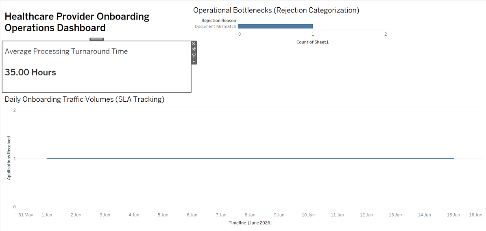

# Healthcare Digital Platform — Business Analysis & Solution Design

**HealthTech | Provider Lifecycle | Patient Care | Digital Healthcare Operations**

## Overview

An independent Business Analysis case study focused on redesigning a
healthcare provider onboarding process that relied heavily on manual
verification and operational handoffs.

The objective was to design a more standardized onboarding workflow with
automated verification, exception handling, SLA visibility, and supporting
operational analytics.

## My Role

**Independent Business Analyst**

I worked across the requirements lifecycle — from problem analysis and
process mapping through functional requirements, solution design, data
modelling, API specifications, user stories, UAT, and analytics.

## The Problem

The existing process involved:

- Manual provider and document verification
- Multiple operational handoffs
- Limited visibility into pending cases and SLA performance
- Delays in provider activation
- Fragmented downstream healthcare operations

## What I Designed

The case study redesigns the provider lifecycle from registration through
verification, approval/exception handling, and activation.

The solution also considers integrations with provider verification, payment,
and notification services.

## Key BA Work

- AS-IS and TO-BE process analysis
- Stakeholder analysis
- BRD and Functional Requirements
- 16 Functional Requirements
- 8 Business Rules
- Functional Solution Architecture
- 8-entity conceptual ERD and Data Dictionary
- 3 REST API Contracts
- 16 Agile User Stories with Gherkin Acceptance Criteria
- UAT and Requirements Traceability Matrix (RTM)

## Data & Analytics

The project includes a focused **PostgreSQL** analytics model built from
sample onboarding data.

The analysis covers onboarding turnaround time, provider approval rate,
SLA compliance, pending verification, rejection reasons, and provider
activation.

> **Note:** The conceptual solution covers the broader healthcare platform
> and its 8-entity data model. The executable PostgreSQL analytics model is
> intentionally scoped to 3 onboarding-related tables used for the sample
> analysis. The SQL results are illustrative sample-data outputs, not
> production measurements.

## Outcome

The proposed TO-BE process targets a reduction in average onboarding
turnaround from **5 business days to <24 hours**, alongside improved SLA
visibility and reduced manual verification effort.

> **Note:** These are target outcomes of the case study, not measured
> production results.

## Repository

The repository contains the core project documentation, data and analytics
assets, SQL execution evidence, and dashboard output:

- [Business Analysis & Solution Design]
- [PostgreSQL Schema](./schema.sql)
- [Sample Dataset](./healthcare_onboarding_data.xlsx)
- [SQL Analytics Queries](./analytics_queries.sql)
- [SQL Execution Results](./sql-query-execution-results.png)
- [Tableau Dashboard](./Tableau_Dashboard.png)

## Preview

### Healthcare Provider Onboarding Operations Dashboard

## What This Project Demonstrates

**Business Analysis → Process Design → Requirements → Solution Design →
Technical Specification → UAT → Data & Analytics**

- End-to-end requirements lifecycle
- Business process analysis and TO-BE design
- Functional and technical requirements
- Data modelling and SQL analysis
- REST API specification
- Agile user-story development
- UAT and requirements traceability
- Translating operational problems into measurable business outcomes

## Tools & Technologies

**Business Analysis & Documentation:**  
Microsoft Word · Microsoft PowerPoint

**Process & Data Modelling:**  
Lucidchart

**Data & Analytics:**  
PostgreSQL · SQL · Tableau

**Technical Specification:**  
REST APIs · JSON
